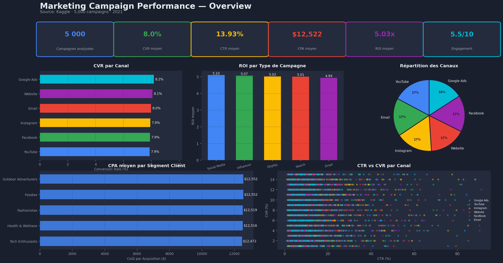
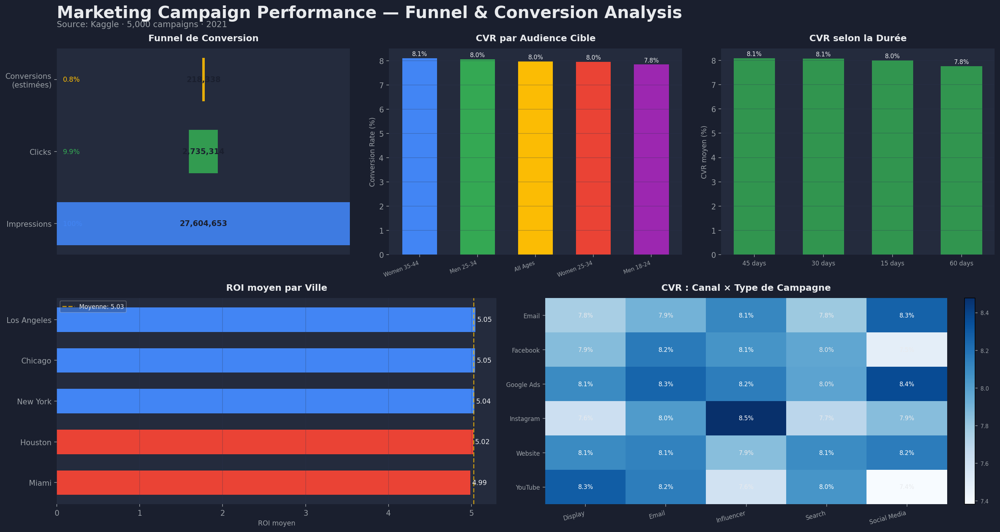
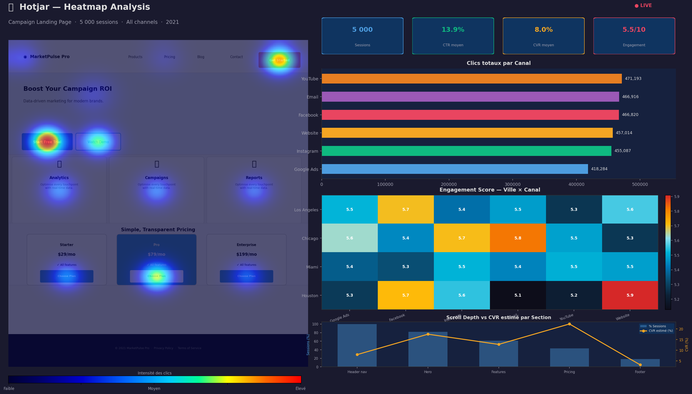

# Web Analytics - Marketing Campaign Analysis

Analyse des performances de campagnes marketing digitales à partir d un dataset Kaggle (200 000 campagnes).

## Objectif

Répliquer le travail d un Chargé Data et Web Analyste : mesurer l efficacité des canaux digitaux, identifier les points de friction dans le funnel de conversion, et formuler des recommandations actionnables.

## KPIs analysés

- **CTR** (Click-Through Rate) : efficacité du message publicitaire
- **CVR** (Conversion Rate) : efficacité de la page et du parcours
- **CPA** (Cost Per Acquisition) : rentabilité par canal
- **ROI** : retour sur investissement par type de campagne
- **Engagement Score** : qualité de l interaction utilisateur

## Stack technique

- Python (Pandas, NumPy, Matplotlib, Seaborn)
- Jupyter Notebook
- Looker Studio (visualisations)
- Hotjar (analyse comportementale)
- Dataset : Marketing Campaign Performance (Kaggle)

## Dashboards

### Vue d ensemble - KPIs et Canaux

### Funnel et Conversion Analysis

### Heatmap comportementale (style Hotjar)

## Structure

web-analytics-marketing-campaign/
- README.md
- analysis.ipynb
- data/marketing_campaign_sample.csv  (echantillon 5000 lignes, 200 000 total)
- dashboard_overview.png
- dashboard_funnel.png
- hotjar_heatmap.png

## Contexte métier

Ce projet s inscrit dans une logique de web analyse appliquée au secteur marketing digital : comprendre d où vient le trafic qualifié, mesurer les taux de conversion par canal (Email, SEO, Paid Ads, Social Media), analyser le comportement utilisateur sur les pages de destination, et proposer des actions pour améliorer le ROI des campagnes.

## Auteur

Amir Meraka - Data Analyst
